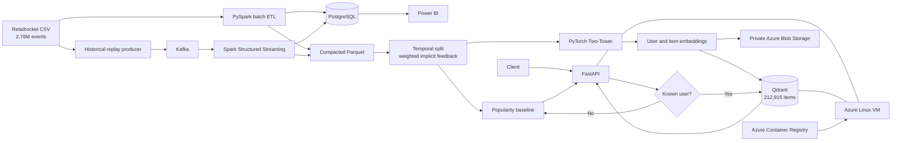

# Real-Time Retail Recommendation & Analytics Platform

An end-to-end data and machine-learning system built on the Retailrocket ecommerce
behavior dataset. The project combines batch and streaming data engineering, analytical
modeling, Power BI, Two-Tower retrieval, vector search, an online API, and a low-cost
Azure deployment.

> **Honest result:** the Two-Tower model did not materially improve Top-10 accuracy over
> popularity on this cold-start-heavy test set. Its strongest measured benefit was
> discovery: catalog coverage increased by about **82.8x**. The production path therefore
> keeps popularity as an explicit cold-start fallback.

## Project at a glance

| Area | Verified result |
|---|---:|
| Events processed | 2,755,641 |
| Users represented in the trained model | 1,123,765 |
| Item embeddings indexed | 212,915 |
| Category match rate during ETL | about 76.2% |
| Expanded evaluation | 4,592 users |
| Cold-start share | 93.3% |
| Catalog coverage lift | about 82.8x |
| Local API validation | 102 requests, 0 server errors, about 13.8 ms average |
| Azure v2 validation | 22 requests, 0 errors, about 13.1 ms server average |
| Automated tests | 14 passing |

## Dashboard


<table>
  <tr>
    <td></td>
    <td></td>
  </tr>
  <tr>
    <td colspan="2"></td>
  </tr>
</table>

The source-controlled Power BI Project is under [`dashboard/powerbi`](dashboard/powerbi).
It contains four pages: Executive Overview, Funnel Analysis, User & Product Analytics,
and Recommendation Performance.

## Architecture



Kafka ingestion and vector retrieval are online. Model training is periodic rather than
continuous, so this project claims **streaming analytics and online recommendation
serving**, not instant online learning.

## Recommendation results

The evaluation sampled 5,000 test users and successfully evaluated 4,592. Only 309 were
warm users; 4,283 used the cold-start path.

| Overall metric | Popularity | Two-Tower + fallback |
|---|---:|---:|
| Hit Rate@10 | 0.00719 | 0.00740 |
| Recall@10 | 0.00636 | 0.00639 |
| NDCG@10 | 0.00342 | 0.00347 |
| Catalog Coverage@10 | 0.0061% | 0.505% |

The accuracy delta is too small to claim a meaningful improvement. The defensible model
result is broader item discovery: approximately 13 unique recommended items from the
popularity baseline versus 1,076 from the Two-Tower/fallback system.

Training used weighted pairwise BPR loss—view `1x`, add-to-cart `3x`, transaction `5x`—
with a temporal train/validation/test split and early stopping. Epoch 2 produced the best
validation loss (`0.3924`). The evaluation artifact records the exact candidate protocol,
seen-item filtering, random seed, warm/cold cohorts, and Top-K metrics.

## Technology

- **Data engineering:** PySpark, Spark Structured Streaming, Kafka, Parquet
- **Analytics:** PostgreSQL, SQL views and snapshot tables, Power BI Project/TMDL
- **Machine learning:** PyTorch Two-Tower, weighted BPR, popularity fallback
- **Serving:** FastAPI, Qdrant, Docker Compose
- **Cloud:** Azure VM, Blob Storage, Container Registry, managed identity, Bicep
- **Quality:** pytest, Ruff, deterministic event IDs, idempotent database writes

## Repository layout

```text
src/retail_stream/
  ingestion/          deterministic Kafka replay
  processing/         batch ETL and Structured Streaming
  recommendation/     temporal data, baseline, Two-Tower, evaluation
  retrieval/          NumPy and Qdrant vector search
  api/                FastAPI recommendation service
scripts/              data loading, compaction and saved-model evaluation
sql/                  PostgreSQL schema and dashboard datasets
dashboard/powerbi/    source-controlled Power BI Project
infrastructure/azure/ Bicep, cloud-init and deployment scripts
docs/                  data dictionary, screenshots and project notes
tests/                 unit and project-generation tests
```

Large raw data, processed Parquet, model weights, vector storage, credentials, Power BI
local caches, and streaming checkpoints are intentionally excluded from Git.

## Local setup

Requirements: Docker Desktop, Python 3.11+, and PowerShell on Windows for the supplied
deployment scripts.

```powershell
Copy-Item .env.example .env
python -m venv .venv
.\.venv\Scripts\Activate.ps1
pip install -e ".[all,dev]"
docker compose up -d broker postgres qdrant
python -m pytest -q
```

Place the four Retailrocket source files in `data/raw/`:

```text
events.csv
item_properties_part1.csv
item_properties_part2.csv
category_tree.csv
```

### Batch ETL

```powershell
docker compose --profile spark run --rm spark `
  /opt/spark/bin/spark-submit `
  --packages org.postgresql:postgresql:42.7.8 `
  /opt/project/src/retail_stream/processing/batch_etl.py `
  --raw-dir /opt/project/data/raw `
  --output /opt/project/data/processed/clean_events
```

The full-data artifacts used for this portfolio run already exist locally, but are not
published because they contain hundreds of megabytes of derived data and model files.
See the scripts and documentation for deterministic reproduction.

### Train and evaluate

```powershell
train-two-tower data/processed/clean_events_compacted `
  --output-dir artifacts/model_full_v1 `
  --epochs 5 `
  --evaluation-k 10

python scripts/evaluate_saved_model.py `
  --model-dir artifacts/model_full_v1 `
  --input data/processed/clean_events_compacted `
  --sample-users 5000
```

### Serve recommendations

```powershell
index-items --model-dir artifacts/model_full_v1
$env:MODEL_DIR = "artifacts/model_full_v1"
$env:USE_QDRANT = "true"
serve-recommendations
```

```powershell
Invoke-RestMethod "http://localhost:8000/health"
Invoke-RestMethod "http://localhost:8000/recommendations/1?k=10&filter_seen=true"
Invoke-RestMethod "http://localhost:8000/recommendations/999999999?k=10"
```

A known user returns `two_tower_retrieval`; an unknown user returns
`popularity_cold_start`. Previously interacted items are filtered by default.

## Azure deployment

The verified student-friendly deployment uses a single `Standard_B2ls_v2` Linux VM in
East Asia. A managed identity reads model artifacts from private Blob Storage and pushes
or pulls the API image from Azure Container Registry. Only API port 8000 is exposed, and
the network security group restricts it to one caller CIDR. Qdrant remains private inside
the Docker network.

Deployment and teardown instructions are in
[`infrastructure/azure/README.md`](infrastructure/azure/README.md). The public IP is not
advertised because the demo is IP-restricted and normally deallocated when idle.

## Engineering decisions

- **Temporal splitting:** avoids leaking future interactions into training.
- **As-of category joins:** item metadata is matched at event time, not from the future.
- **Deterministic event IDs:** makes Kafka/Spark retries safe to deduplicate.
- **Cold-start fallback:** never attempts to retrieve with a nonexistent user embedding.
- **Seen-item filtering:** avoids recommending products already observed by the user.
- **Idempotent indexing:** retains a complete Qdrant collection on restart.
- **Cost-aware cloud design:** keeps Spark, Kafka, PostgreSQL, training, and Power BI local;
  Azure hosts only the online inference path.

## Limitations and next steps

- Retailrocket contains anonymous IDs rather than product titles or descriptions.
- With 93.3% cold users, an ID-only user tower has limited opportunity to personalize.
- Funnel stages are independent distinct-user populations; they do not prove an ordered
  same-user journey.
- Ranking accuracy remains low and nearly flat versus popularity.
- Stronger next iterations would add history/category features, improved negative
  sampling, warm-user evaluation at larger K, and a lightweight reranker.

See [`docs/RESUME_BULLETS.md`](docs/RESUME_BULLETS.md) for resume-ready descriptions and
[`docs/DATA_DICTIONARY.md`](docs/DATA_DICTIONARY.md) for the analytical schema. The final
publishing steps and suggested repository metadata are in
[`docs/GITHUB_PUBLISHING.md`](docs/GITHUB_PUBLISHING.md).
