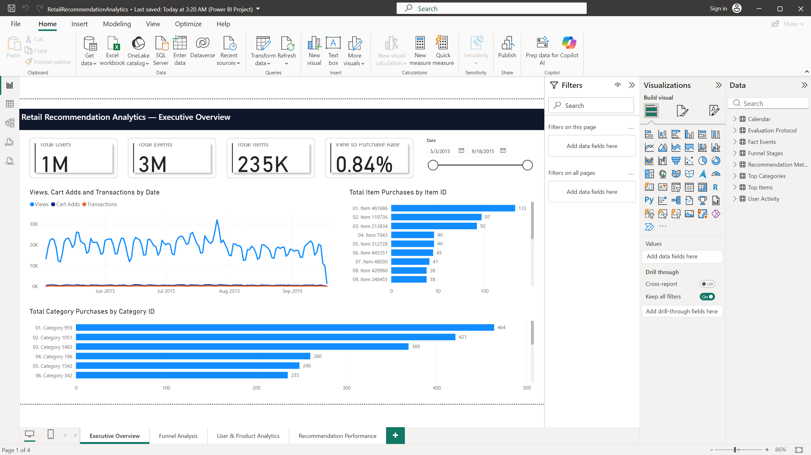
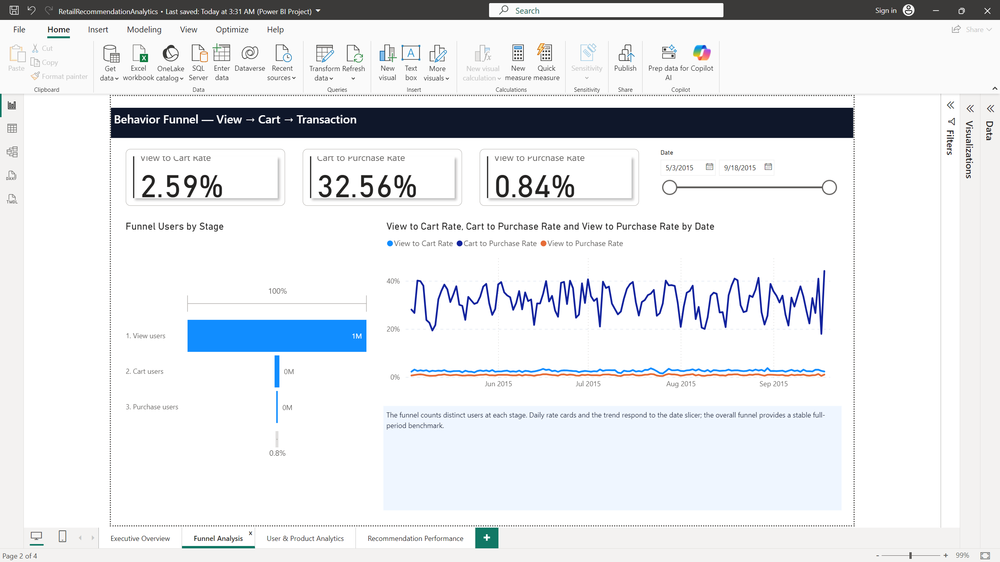
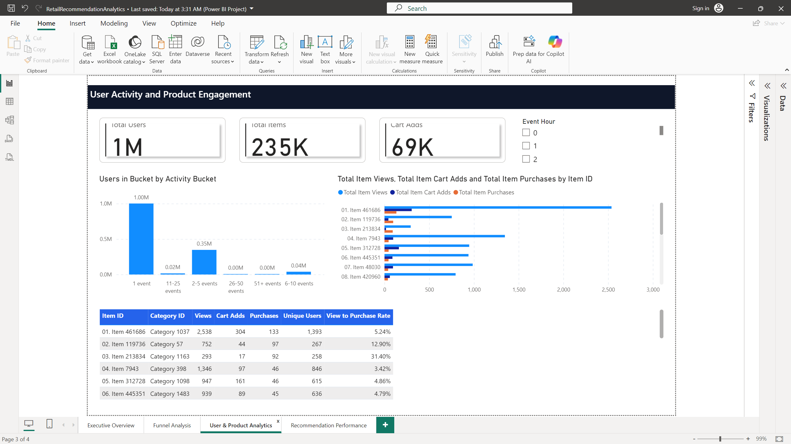
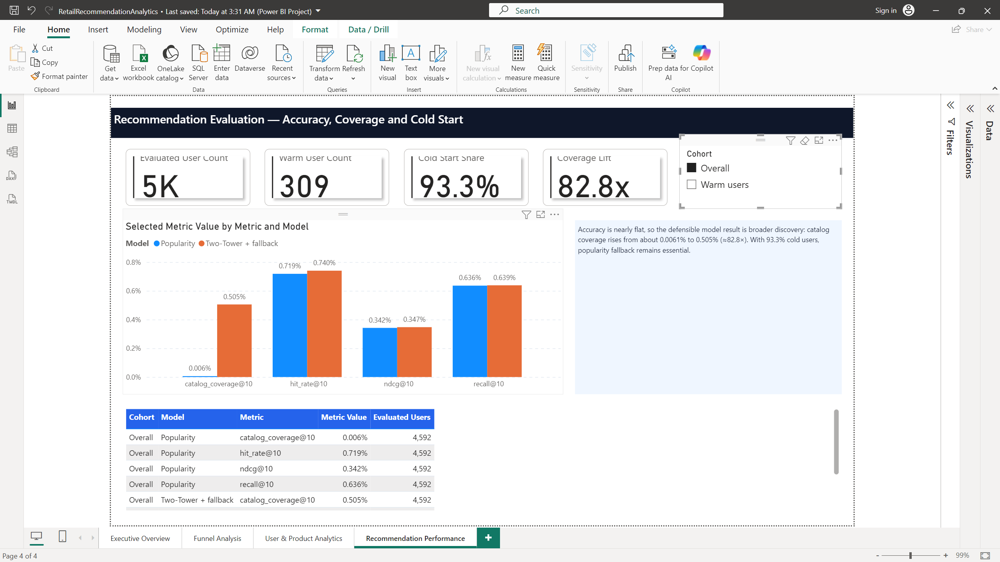

# Power BI dashboard

The validated, source-controlled Power BI Project is:

```text
dashboard/powerbi/RetailRecommendationAnalytics.pbip
```

It contains eight semantic-model tables and four report pages. No PostgreSQL password is
stored in the source-controlled project definition. Power BI local caches and settings
under `.pbi/` are excluded from Git.

## Screenshots

### Executive overview



### Funnel analysis



### User and product analytics



### Recommendation performance



## Open and refresh

1. Keep the project PostgreSQL service running on `localhost:5432`.
2. Open `RetailRecommendationAnalytics.pbip` with a current Power BI Desktop release.
3. When prompted, choose **Database** authentication:

   - Server: `localhost:5432`
   - Database: `retail_analytics`
   - Username: `retail`
   - Password: the local development value from `.env`

4. If Power BI reports that encrypted PostgreSQL connectivity is unavailable, accept the
   unencrypted connection only for this local `localhost` development database.
5. Select **Home > Refresh**, wait for all visuals to render, and save the project.

The four aggregate datasets—items, categories, activity, and funnel stages—are PostgreSQL
snapshot tables exposed through simple views. Power BI refresh imports these snapshots;
it does not recompute them after the fact-event table changes. Rebuild the snapshots with
`sql/003_dashboard_views.sql`, then refresh Desktop.

To resynchronize evaluation metrics from the saved model artifact:

```powershell
docker compose --profile spark run --rm spark python3 `
  /opt/project/scripts/load_evaluation_metrics_to_postgres.py `
  --input /opt/project/artifacts/model_full_v1/expanded_metrics.json
```

## Page definitions

### 1. Executive Overview

- Total users, events, items, and purchase-event/view-event ratio
- Daily view, cart-add, and transaction trend
- Full-period Top 20 items and Top 15 categories by purchase events
- Date slicer for time-sensitive cards and trends

### 2. Funnel Analysis

- Distinct users at view, cart, and transaction stages
- View-to-cart, cart-to-purchase, and view-to-purchase event ratios
- Daily rate trend and date slicer
- Stages are independent populations; no same-user ordering is implied

### 3. User & Product Analytics

- User activity distribution across event-count buckets
- Product-level views, cart adds, purchases, unique users, and purchase/view ratio
- Top product engagement comparison
- Event-hour slicer

### 4. Recommendation Performance

- Popularity versus Two-Tower/fallback Recall@10, NDCG@10, Hit Rate@10, and coverage
- Overall and warm-user cohort selector
- 4,592 evaluated users, 309 warm users, 93.3% cold-start share
- Explicit note that accuracy is nearly flat while coverage increases about 82.8x

The source data contains anonymous item and category IDs, not product names. Labels are
therefore intentionally presented as `Item <id>` and `Category <id>` rather than invented
business descriptions.
